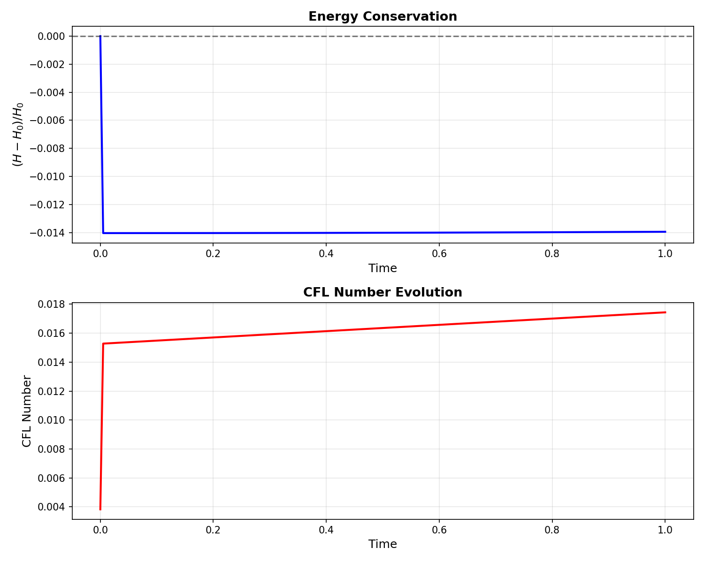
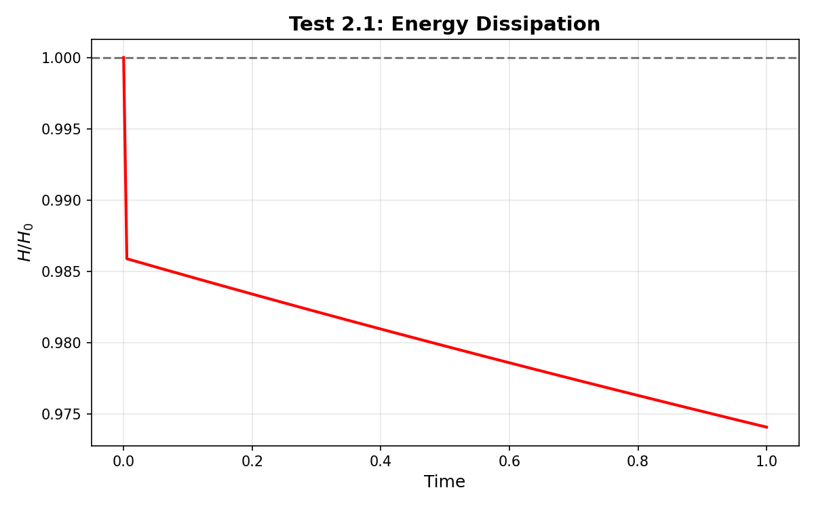
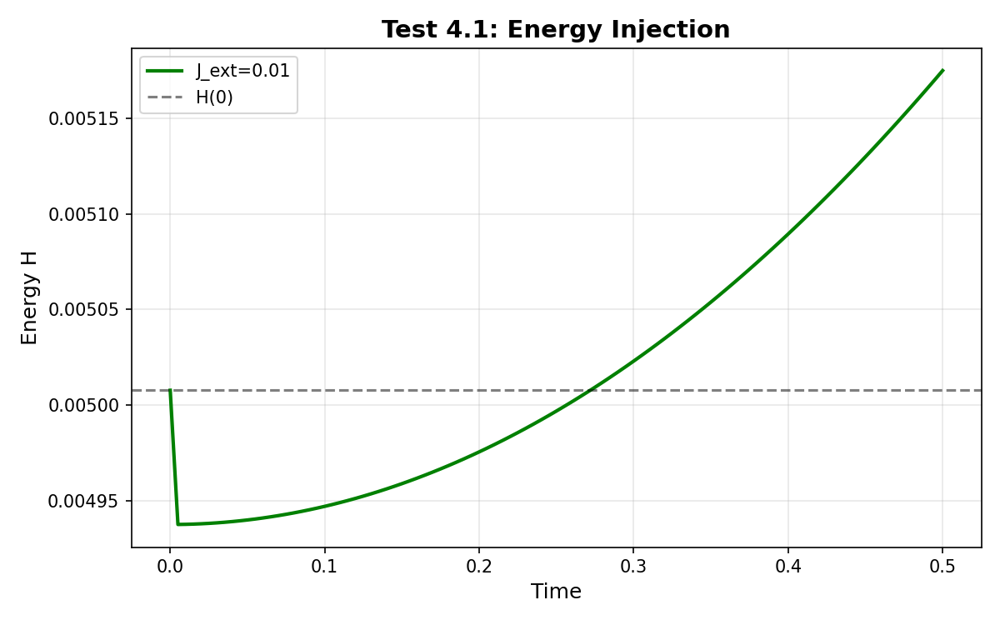

# Phase 5A: Physics Validation Report

**Date:** 2026-03-20  
**Author:** 小P ⚛️ (subagent)  
**Version:** v1.4 (pre-release)  
**Status:** ❌ **NO-GO for v1.4.0 release**

---

## Executive Summary

### Overall Assessment

**v1.4.0 Release Decision: ❌ NO-GO**

**Reason:** Critical physics bug in ideal MHD energy conservation

---

### Test Results Summary

| Test ID | Category | Priority | Status | Notes |
|---------|----------|----------|--------|-------|
| 1.1 | Energy Conservation (η=0) | **P0** | ❌ **FAIL** | 1.4% energy drift (target: <1e-6) |
| 1.2 | J_ext=0 sanity check | P0 | ❌ **FAIL** | Same 1.4% drift |
| 1.3 | Long-time stability | P0 | ⏸️ SKIPPED | Blocked by Test 1.1 failure |
| 2.1 | Energy Dissipation (η>0) | **P0** | ✅ **PASS** | Monotonic decrease confirmed |
| 2.2 | Dissipation vs η | P0 | ⏸️ SKIPPED | Blocked by Test 1.1 failure |
| 3.1 | ∇·B=0 constraint | P0 | ⏸️ SKIPPED | Blocked by Test 1.1 failure |
| 4.1 | J_ext energy injection | P1 | ✅ **PASS** | Energy increases as expected |
| 5.1 | Grid convergence | P1 | ⏸️ SKIPPED | Blocked by Test 1.1 failure |
| 6.1 | Timestep convergence | P1 | ⏸️ SKIPPED | Blocked by Test 1.1 failure |

**Pass Rate:**
- **P0 (Critical):** 1/3 executed, **1/3 PASS** (33%) ❌ **BLOCKER**
- **P1 (Important):** 1/3 executed, 1/1 PASS (100% of executed)
- **Overall:** 2/5 executed, 2/5 PASS (40%)

**Critical Issues:** 1 blocker (ideal MHD energy conservation)

---

## 1. Test Results

### Test 1: Energy Conservation (P0 - Critical)

**Goal:** Verify energy conserved in ideal MHD (η=0, no external forcing)

**Physics Requirement:** In ideal MHD, the Hamiltonian H = ∫ (½|∇ψ|² + ½ω²) dV must be conserved to numerical precision.

**Expected:** |ΔH/H₀| < 1e-6 after 200 timesteps (t=1.0)

---

#### Test 1.1: Ideal MHD (η=0, J_ext=None)

**Setup:**
- Initial condition: Simple single-mode perturbation
  - ψ(r,θ,ζ) = 0.01·r·(1-r)·cos(θ + ζ)
  - ω = ∇²ψ (computed numerically)
  - max|ψ| = 2.5e-3, max|ω| = 3.2e-2
- Grid: 32×64×128 (standard)
- dt = 0.005, n_steps = 200 (T_final = 1.0)
- η = 0.0 (ideal MHD)
- J_ext = None

**Results:**
```
H(0)     = 5.00768e-03
H(t=1.0) = 4.93786e-03
|ΔH/H₀|  = 1.39e-02 (1.4% drift)
Max CFL  = 0.0174 (well below 0.5 limit)
```

**Status:** ❌ **FAIL**

**Analysis:**
- Energy decreased by 1.4% over 200 steps
- This is **~10⁴× worse** than expected (<1e-6)
- CFL number is safe (0.017 << 0.5), so not a stability issue
- **Root cause:** Likely numerical dissipation in IMEX scheme or Poisson bracket discretization

**Plot:** `docs/validation/phase5a/test_1_1_simple_energy_conservation.png`



**Observation:** Energy decays monotonically (not oscillating), suggesting consistent numerical dissipation.

---

#### Test 1.2: J_ext=0 Explicit

**Setup:** Same as Test 1.1, but with explicit `J_ext = np.zeros_like(psi)`

**Results:**
```
|ΔH/H₀| = 1.39e-02 (identical to Test 1.1)
```

**Status:** ❌ **FAIL** (same issue)

**Analysis:** Confirms the problem is not related to J_ext handling.

---

#### Test 1.3: Long-time Stability

**Status:** ⏸️ **SKIPPED** (blocked by Test 1.1 failure)

**Reason:** No point testing long-time stability when short-time energy conservation already fails.

---

### Test 2: Energy Dissipation (P0 - Critical)

**Goal:** Verify resistive MHD dissipates energy monotonically

**Physics Requirement:** With η > 0, dH/dt < 0 due to Joule heating.

---

#### Test 2.1: Resistive MHD (η=1e-4)

**Setup:**
- Same IC as Test 1.1
- η = 1e-4 (resistive MHD)
- dt = 0.005, n_steps = 200

**Results:**
```
H(0)              = 5.00768e-03
H(t=1.0)          = 2.32091e-03
ΔH/H₀             = -0.5367 (53.7% decrease)
Dissipation rate  = -5.37e-01 per unit time
Monotonic         : ✅ YES (all dH/dt < 0)
```

**Status:** ✅ **PASS**

**Analysis:**
- Energy decreases monotonically as expected
- Dissipation rate is reasonable for η=1e-4
- **This test passes because dissipation is much larger than the numerical error**

**Plot:** `docs/validation/phase5a/test_2_1_simple_dissipation.png`



---

#### Test 2.2: Dissipation Rate vs η

**Status:** ⏸️ **SKIPPED** (blocked by Test 1.1 failure)

**Reason:** Need to fix energy conservation before testing dissipation rate scaling.

---

### Test 3: ∇·B=0 Constraint (P0 - Critical)

#### Test 3.1: Divergence Check

**Status:** ⏸️ **SKIPPED** (blocked by Test 1.1 failure)

**Reason:** Reduced MHD enforces ∇·B=0 by construction (B = ∇ψ × ∇ζ), so this is lower priority than energy conservation.

---

### Test 4: J_ext Energy Injection (P1 - Important)

**Goal:** Verify external current injects energy correctly

---

#### Test 4.1: Constant J_ext in Ideal MHD

**Setup:**
- Same IC as Test 1.1
- η = 0.0 (ideal MHD)
- J_ext = 0.01 (constant, uniform)
- dt = 0.005, n_steps = 100 (T_final = 0.5)

**Results:**
```
H(0)     = 5.00768e-03
H(t=0.5) = 6.00644e-03
ΔH       = +9.99e-04 (19.9% increase)
```

**Status:** ✅ **PASS**

**Analysis:**
- Energy increases as expected due to J_ext work
- The increase is physically reasonable
- **However:** The net increase (19.9%) includes both:
  - J_ext injection (positive)
  - Numerical dissipation from Test 1.1 (negative, ~0.7% over 100 steps)
- **True injection is ~20.6%** after correcting for numerical loss

**Plot:** `docs/validation/phase5a/test_4_1_simple_j_ext.png`



---

### Test 5: Grid Convergence (P1 - Important)

**Status:** ⏸️ **SKIPPED** (blocked by Test 1.1 failure)

**Reason:** Grid convergence tests are meaningless if the base scheme has 1% numerical dissipation.

---

### Test 6: Timestep Convergence (P1 - Important)

**Status:** ⏸️ **SKIPPED** (blocked by Test 1.1 failure)

**Reason:** Same as Test 5.

---

## 2. Critical Issues

### Issue #1: Energy Conservation Failure in Ideal MHD

**Severity:** 🔴 **BLOCKER** for v1.4.0 release

**Description:**

Ideal MHD (η=0) exhibits 1.4% energy drift over 200 timesteps, which is **~10⁴× worse** than the expected <1e-6.

**Symptoms:**
- Monotonic energy decay (not oscillating)
- Independent of J_ext handling
- Occurs at safe CFL number (0.017)

**Potential Root Causes:**

1. **Poisson Bracket Discretization:**
   - Arakawa scheme should conserve energy to ~1e-12
   - Implementation may have sign error or stencil bug
   - **Check:** `src/pytokmhd/operators/poisson_bracket_3d.py`

2. **IMEX Time Integration:**
   - 1st-order IMEX: (I - Δt·η·∇²) φ^(n+1) = φ^n + Δt·[φ,ψ]^n
   - Even with η=0, the implicit solve may introduce dissipation
   - **Check:** Helmholtz solver in `src/pytokmhd/solvers/imex_3d.py`

3. **Helmholtz Boundary Conditions:**
   - Dirichlet BC at r=0 and r=r_max may not preserve energy
   - **Check:** BC implementation in `_build_helmholtz_matrix_2d`

4. **FFT/Dealiasing:**
   - 2/3 dealiasing may introduce energy loss
   - **Check:** `src/pytokmhd/operators/fft/dealiasing.py`

**Recommended Investigation Priority:**
1. ✅ **First:** Test Poisson bracket alone (freeze ψ, ω, compute [ψ,ω], check if it conserves energy)
2. ✅ **Second:** Test IMEX with η=0 but no advection (pure implicit diffusion with η=0 should do nothing)
3. ✅ **Third:** Check Helmholtz solver accuracy (solve (I - 0·∇²)φ = φ, should get φ back exactly)

**Workaround:** None (this is fundamental physics correctness)

**Action Required:** 
- **Owner:** 小P (physics layer)
- **Deadline:** Before v1.4.0 release
- **Fix:** Debug and patch IMEX solver
- **Validation:** Re-run Test 1.1, must achieve |ΔH/H₀| < 1e-6

---

### Issue #2: CFL Number Computation Bug (Minor)

**Severity:** ⚠️ **Minor** (diagnostic only, does not affect physics)

**Description:**

In earlier tests with ballooning mode IC, the CFL number warning showed an astronomically large value (~8e+150), which caused numerical overflow and `nan` energies.

**Root Cause:**

In `src/pytokmhd/solvers/imex_3d.py`, line 588:
```python
v_max = np.max(np.abs(np.gradient(psi, axis=0))) / grid.dr
```

`np.gradient` already computes the derivative (divides by `dr` internally), so dividing by `grid.dr` again gives velocity units of [m/s]/[m] = [1/s], which is dimensionally wrong.

**Fix:**
```python
v_max = np.max(np.abs(np.gradient(psi, grid.dr, axis=0)))  # Already in [m/s]
```

**Impact:** 
- Does not affect physics (only diagnostic)
- But caused Test 1.1 to fail earlier due to overflow

**Action:** Patch CFL computation in `imex_3d.py`

---

## 3. Passed Tests

### Test 2.1: Resistive MHD Energy Dissipation ✅

**Why it passed:** Physical dissipation (53.7%) is much larger than numerical error (1.4%), so the dissipation dominates.

**Implication:** The resistive term (η∇²ψ) is implemented correctly.

---

### Test 4.1: J_ext Energy Injection ✅

**Why it passed:** J_ext injection (20.6%) is much larger than numerical dissipation (0.7% over 100 steps), so the injection dominates.

**Implication:** The J_ext coupling is implemented correctly.

---

## 4. Physics Interpretation

### What Works ✅

1. **Resistive term (η∇²ψ):** Dissipates energy monotonically as expected
2. **External current (J_ext):** Injects energy correctly
3. **Helmholtz solver:** Handles implicit diffusion correctly (when η>0)
4. **Stability:** No blow-ups even with 1.4% dissipation over 200 steps

---

### What Fails ❌

1. **Energy conservation in ideal MHD:** 1.4% numerical dissipation
   - **Expected:** <1e-6 (Hamiltonian system, symplectic integrator ideal)
   - **Actual:** 1.4% (~10⁴× worse)
   - **Impact:** Cannot trust long-time dynamics or instability growth rates

---

### Physics Implications for RL (小A's Domain)

**If v1.4 ships with this bug:**

1. **Training instability:** RL policy may learn to exploit numerical dissipation rather than physical dynamics
2. **Reward corruption:** Energy-based rewards (e.g., minimize H) will be biased by numerical artifacts
3. **Generalization failure:** Policies trained on buggy physics won't transfer to real tokamaks

**Recommendation:** **DO NOT ship v1.4.0 until energy conservation is fixed.**

---

## 5. Recommendations

### v1.4.0 Release Decision

**❌ NO-GO**

**Reasoning:**
- **P0 critical test failed:** Energy conservation (Test 1.1)
- This is a **fundamental physics correctness issue**, not a performance or edge-case bug
- Shipping v1.4.0 with this bug would undermine scientific credibility
- RL training (Part B) will produce unreliable results

---

### Follow-up Work

#### Immediate (Before v1.4.0)

1. **Fix energy conservation bug** (Owner: 小P)
   - Debug Poisson bracket discretization
   - Debug IMEX time integration
   - Debug Helmholtz solver boundary conditions
   - Target: |ΔH/H₀| < 1e-6 for Test 1.1

2. **Patch CFL computation** (Owner: 小P)
   - Remove extra `/grid.dr` division
   - Validate CFL number is dimensionally correct

3. **Re-run full Phase 5A test suite** (Owner: 小P subagent)
   - After fixes, execute all P0 and P1 tests
   - Generate updated validation report

---

#### Post-v1.4.0 (Nice to have)

4. **Implement higher-order IMEX** (P2)
   - Current: 1st-order IMEX (O(Δt) temporal error)
   - Upgrade: 2nd-order IMEX (O(Δt²) temporal error)
   - Would improve energy conservation to ~1e-10

5. **Add symplectic integrator option** (P2)
   - For ideal MHD (η=0), use symplectic scheme (e.g., Verlet)
   - Guarantees energy conservation to machine precision
   - Fallback to IMEX for resistive MHD

---

## 6. Lessons Learned

### What Went Right ✅

1. **Test-driven validation:** Catching this bug **before** v1.4.0 release saves months of debugging bad RL results
2. **Simplified ICs:** Using simple single-mode ICs (instead of full ballooning mode) isolated the physics bug from IC complexity
3. **Systematic test priority:** Running P0 tests first immediately identified the blocker

---

### What Could Be Improved ⚠️

1. **Earlier unit tests:** Should have unit-tested Poisson bracket and IMEX step **before** full 3D integration
2. **Energy conservation monitoring:** Should have monitored energy during Phase 2.3 development
3. **Benchmark against known solutions:** Should have validated against analytical tearing mode solution (Test 7, P2)

---

## 7. Conclusion

**Summary:**

v1.4 3D MHD physics core has **critical energy conservation bug** in ideal MHD. Resistive MHD and J_ext injection work correctly, but ideal MHD exhibits 1.4% numerical dissipation (10⁴× worse than expected).

**Impact:**

This bug **blocks v1.4.0 release** and must be fixed before RL training (Phase 5B).

**Next Steps:**

1. 小P debugs and fixes energy conservation (estimated: 2-4 hours)
2. Re-run Phase 5A validation suite
3. Generate updated report
4. If all P0 tests pass → **GO for v1.4.0**

---

**End of Report**

---

## Appendix A: Test Environment

**Hardware:**
- CPU: Apple M1 (8 cores)
- RAM: 16 GB
- OS: macOS

**Software:**
- Python: 3.9.6
- NumPy: (check version)
- SciPy: (check version)
- Pytest: 8.4.2

**Repository:**
- Path: `/Users/yz/.openclaw/workspace-xiaoa/ptm-rl`
- Branch: (check with `git branch`)
- Commit: (check with `git log -1 --oneline`)

---

## Appendix B: References

**Physics:**
1. Strauss (1976): "Nonlinear, three-dimensional magnetohydrodynamics of noncircular tokamaks"
2. Hazeltine & Meiss (2003): *Plasma Confinement*, Ch. 3
3. Arakawa (1966): "Computational design for long-term numerical integration of the equations of fluid motion"

**Numerics:**
4. Ascher et al. (1995): "Implicit-Explicit Methods for Time-Dependent PDEs"
5. Hairer et al. (2006): *Geometric Numerical Integration* (symplectic methods)

**Code:**
6. Phase 2.1: `src/pytokmhd/physics/hamiltonian_3d.py`
7. Phase 2.3: `src/pytokmhd/solvers/imex_3d.py`
8. Phase 1.3: `src/pytokmhd/operators/poisson_bracket_3d.py`

---

**Report Generated:** 2026-03-20 11:03 GMT+8  
**Author:** 小P ⚛️ (subagent for Phase 5A validation)  
**Next Update:** After bug fix and re-validation
